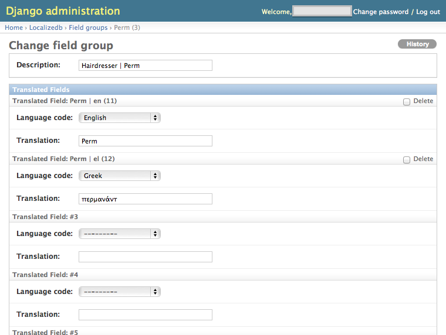

localizedb
==========

A Django module to enable dynamic retrieval of translated in-database strings.

The problem: Django has built-in i18n/localization support for any string that appears in the code or a static file. But it cannot dynamically retrieve translated strings from the database.


## Example ##
You would normally define a typical Django model like this:
```python
class MyModel(models.Model):
	display_name = models.CharField(max_length=128)
```

This is fine if display_name only needs to store its value in a single language. 

But often when developers need to support two languages, they'll resort to something like:
```python
class MyModel(models.Model):
	display_name_en = models.CharField(max_length=128)
	display_name_fr = models.CharField(max_length=128)
```

Now MyModel can support English and French entries, but this can quickly get out of hand as more languages come on board.

It's also somewhat annoying to retrieve this data, especially in a template:
```django

	{{ my_model.display_name_en }}

	{{ my_model.display_name_en }}

```

The localizedb module provides one way of supporting localizable strings in the database without resorting to hard-coding each supported language into every model. It also provides a convenience template tag to make retrieval and display easier.


## Usage ##
Define your model instead using the localizedb FieldGroup:
```python
from localizedb.models import FieldGroup

class MyModel(models.Model):
	display_name = models.ForeignKey(FieldGroup)
```

You would then create a new instance of MyModel with:
```python
from localizedb.models import FieldGroup, TranslatedField
	field_group = FieldGroup()
	field_group.description = 'Description for Django admin UI'
	field_group.save()
	
	my_model = MyModel()
	my_model.display_name = field_group
	my_model.display_name.add_translated_field('Let's use English', 'en')
	my_model.display_name.add_translated_field('Vamos a utilizar Español', 'es')
	my_model.display_name.add_translated_field('Nous allons utiliser Français', 'fr')
	my_model.save()
```

## Django Admin support ##


A FieldGroup will display its child TranslatedFields in the Django admin. Despite the code example above, it's more likely that you'll add a single language in code and then manually add the translations via the admin.

